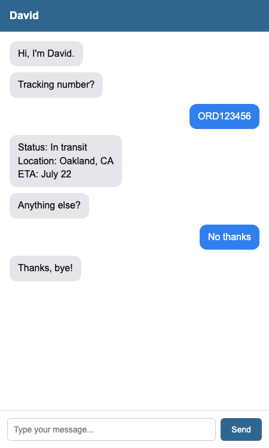
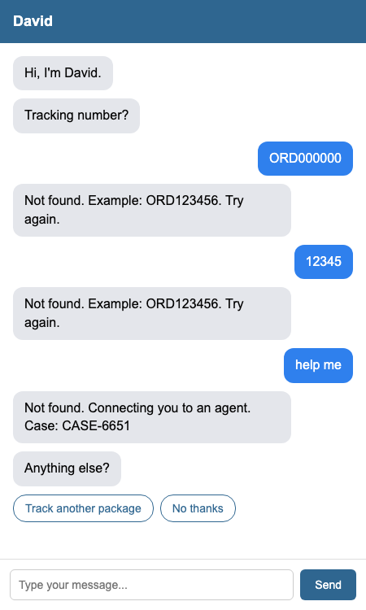

# David

Chatbot that tracks a lost package.

## Run

Open index.html in a browser.

## Approach

One step variable tracks the conversation. One if/else chain on step decides what to say next. Package data is hardcoded.

## Error handling

- Bad tracking number: shows example, asks retry. 3 fails, hands off to agent with a fake case number.
- Unexpected input at a buttons step: checks text for "yes"/"no", else repeats the question.

## Test inputs

| Type                         | Result                 |
| ---------------------------- | ---------------------- |
| `ORD123456`                  | In transit             |
| `ORD234567`                  | Delayed                |
| `ORD345678`                  | Delivered, then Yes/No |
| Bad number x3                | Agent handoff          |
| Random text at a button step | Repeats question       |

## Screenshots

